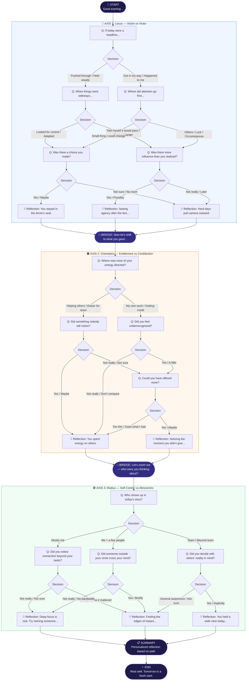

[tree-diagram.md](https://github.com/user-attachments/files/26921799/tree-diagram.md)
# Daily Reflection Tree — Visual Diagram

```mermaid
flowchart TD
    START([🌙 START\nGood evening...]) --> A1_OPEN

    subgraph AXIS1 ["🔵 AXIS 1: Locus — Victim vs Victor"]
        A1_OPEN[Q: If today were a headline...] --> A1_D1{Decision}
        A1_D1 -->|Pushed through / Held steady| A1_Q_AGENCY_HIGH[Q: When things went sideways...]
        A1_D1 -->|Got in my way / Happened to me| A1_Q_AGENCY_LOW[Q: Where did attention go first...]

        A1_Q_AGENCY_HIGH --> A1_D2{Decision}
        A1_D2 -->|Looked for control / Adapted| A1_Q_CHOICE
        A1_D2 -->|Told myself it would pass / Pushed harder| A1_Q_AWARENESS

        A1_Q_AGENCY_LOW --> A1_D3{Decision}
        A1_D3 -->|Others / Luck / Circumstances| A1_Q_AWARENESS
        A1_D3 -->|Small thing I could change| A1_Q_CHOICE

        A1_Q_CHOICE[Q: Was there a choice you made?] --> A1_D4{Decision}
        A1_D4 -->|Yes / Maybe| A1_R_INTERNAL[💡 Reflection: You stayed in the driver's seat]
        A1_D4 -->|Not sure / No room| A1_R_EXTERNAL[💡 Reflection: Hard days pull camera outward]

        A1_Q_AWARENESS[Q: Was there more influence than you realized?] --> A1_D5{Decision}
        A1_D5 -->|Yes / Possibly| A1_R_EMERGING[💡 Reflection: Seeing agency after the fact...]
        A1_D5 -->|Not really / Later| A1_R_EXTERNAL
    end

    A1_R_INTERNAL --> BRIDGE_1_2
    A1_R_EMERGING --> BRIDGE_1_2
    A1_R_EXTERNAL --> BRIDGE_1_2

    BRIDGE_1_2([🔗 BRIDGE: Now let's shift to what you gave...]) --> A2_OPEN

    subgraph AXIS2 ["🟠 AXIS 2: Orientation — Entitlement vs Contribution"]
        A2_OPEN[Q: Where was most of your energy directed?] --> A2_D1{Decision}
        A2_D1 -->|Helping others / Easier for team| A2_Q_CONTRIBUTION[Q: Did something nobody will notice?]
        A2_D1 -->|My own work / Getting credit| A2_Q_ENTITLEMENT[Q: Did you feel underrecognized?]

        A2_Q_CONTRIBUTION --> A2_D2{Decision}
        A2_D2 -->|Yes / Maybe| A2_R_CONTRIBUTION[💡 Reflection: You spent energy on others]
        A2_D2 -->|Not really / Not sure| A2_Q_EXTRA

        A2_Q_ENTITLEMENT --> A2_D3{Decision}
        A2_D3 -->|Yes / A little| A2_Q_EXTRA
        A2_D3 -->|Not really / Don't compare| A2_R_CONTRIBUTION

        A2_Q_EXTRA[Q: Could you have offered more?] --> A2_D4{Decision}
        A2_D4 -->|Yes / Maybe| A2_R_GROWING[💡 Reflection: Noticing the moment you didn't give...]
        A2_D4 -->|Too thin / Gave what I had| A2_R_CONTRIBUTION
    end

    A2_R_CONTRIBUTION --> BRIDGE_2_3
    A2_R_GROWING --> BRIDGE_2_3

    BRIDGE_2_3([🔗 BRIDGE: Let's zoom out — who were you thinking about?]) --> A3_OPEN

    subgraph AXIS3 ["🟢 AXIS 3: Radius — Self-Centric vs Altrocentric"]
        A3_OPEN[Q: Who shows up in today's story?] --> A3_D1{Decision}
        A3_D1 -->|Mostly me| A3_Q_NARROW[Q: Did you notice connection beyond your tasks?]
        A3_D1 -->|Me + a few people| A3_Q_MID[Q: Did someone outside your circle cross your mind?]
        A3_D1 -->|Team / Beyond team| A3_Q_WIDE[Q: Did you decide with others' reality in mind?]

        A3_Q_NARROW --> A3_D2{Decision}
        A3_D2 -->|Briefly / Knew it mattered| A3_R_GROWING[💡 Reflection: Feeling the edges of impact...]
        A3_D2 -->|Not really / Not sure| A3_R_NARROW[💡 Reflection: Deep focus is real. Try naming someone...]

        A3_Q_MID --> A3_D3{Decision}
        A3_D3 -->|Yes / Briefly| A3_R_GROWING
        A3_D3 -->|Not really / No bandwidth| A3_R_NARROW

        A3_Q_WIDE --> A3_D4{Decision}
        A3_D4 -->|Yes / Implicitly| A3_R_WIDE[💡 Reflection: You held a wide view today...]
        A3_D4 -->|General awareness / Not sure| A3_R_GROWING
    end

    A3_R_NARROW --> SUMMARY
    A3_R_GROWING --> SUMMARY
    A3_R_WIDE --> SUMMARY

    SUMMARY([📋 SUMMARY\nPersonalized reflection based on path]) --> END
    END([✨ END\nRest well. Tomorrow is a fresh start.])

    style START fill:#1e1b4b,color:#fff
    style BRIDGE_1_2 fill:#312e81,color:#fff
    style BRIDGE_2_3 fill:#312e81,color:#fff
    style SUMMARY fill:#1e1b4b,color:#fff
    style END fill:#1e1b4b,color:#fff
    style AXIS1 fill:#eff6ff,stroke:#3b82f6
    style AXIS2 fill:#fff7ed,stroke:#f97316
    style AXIS3 fill:#f0fdf4,stroke:#22c55e
```
